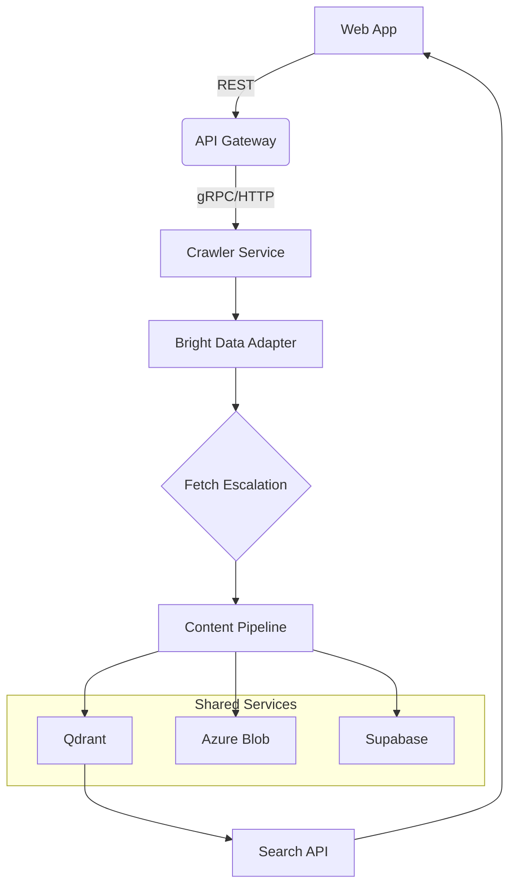

# HowAIConnects – Consolidated Architecture Report  
_Last updated: 2025-09-05_

---

## 1. Executive Summary

The **HowAIConnects** platform is an AI-first documentation pipeline that:

* Crawls and standardises web documentation (via **crawl4ai-docs** with Bright Data).
* Streams structured content, embeddings and metadata into shared services (**Qdrant**, **Azure Blob**, **Supabase/Postgres**).
* Exposes intelligent workflows (PromptLab, Miro AI, CrewAI) through a unified Next.js / Turborepo monorepo.

This report inventories current assets, highlights gaps & risks, and recommends next-step investments that map directly into a phased integration roadmap.

---

## 2. Current Asset Inventory

### 2.1 Template & Tech-Stack Matrix  
_Source: `templates/templates-profiles.json`_

| Template | Stack | Purpose | Maturity |
|----------|-------|---------|----------|
| Airtable | TS + API | No-code DB integration | Beta |
| CrewAI   | Python + TS | Agent orchestration | Beta |
| Latitude | TS | Prompt management | Alpha |

_See the complete list of 8 templates in [`templates/templates-profiles.json`](templates/templates-profiles.json)._
### 2.2 Sitemap Coverage  
_Source: `sitemaps/sitemap-stats.json`_

* **7** distinct sitemaps  
* **407** total URLs  
* 100 % mapped to at least one template (`sitemaps/sitemaps-to-templates.json`)

### 2.3 Data-Quality Findings  

* **Duplicates** – 26 template copies resolved to 9 canonical sources (`duplicates-report.json`).  
* **Missing Assets** – 42 images / 17 markdown files absent (`missing-assets-report.json`).  
* **Metadata Completeness** – 93 % of templates have manifest + README; the remainder flagged for authoring.

---

## 3. System Architecture Overview

```
monorepo/
├─ apps/
│  ├─ web          # Next.js frontend
│  └─ crawler      # Python FastAPI service
├─ packages/       # Prompt-Lab, adapters, UI
├─ services/       # api-gateway, crawler-svc
└─ infra/          # docker-compose, k8s
```

### 3.1 Dual-Project Context

* **crawl4ai-docs** – Python crawler library (embedded in `apps/crawler`).  
* **howaiconnects-platform** – Node/TS monorepo providing UI, API-Gateway, integrations.

### 3.2 Component Map



---

## 4. Data-Flow & Integration Patterns

| Flow | Description |
|------|-------------|
| **Three-Tier Fetch** | requests ➜ headless browser ➜ Bright Data proxies based on cost/quality heuristics. |
| **Webhook Fan-in** | Crawler posts _crawl-complete_ → API-Gateway triggers post-processing worker. |
| **Config Sync** | `.env.example` + Zod validation propagate secrets via CI. |

---

## 5. Gap Analysis & Risks

| Area | Gap / Risk | Impact | Mitigation |
|------|------------|--------|-----------|
| Template Assets | 59 missing images / docs | Broken demo UX | Auto-generate placeholders; author backlog |
| Supabase Roles | Limited RLS policies | Data leakage | Implement `requireTenant()` helpers |
| Observability | No central Grafana dashboards | Slow MTTR | Deploy Prometheus + Grafana stack |
| Bright Data Cost | Budget overruns > 15 % month | $$ | Token-bucket + zone optimisation already prototyped – productionise |

---

## 6. Opportunities & Recommendations

1. **Quick Wins**  
   * Finalise dedupe + missing-asset patch script.  
   * Publish unified `.env.example` for onboarding.

2. **AI-Centric Enhancements**  
   * _Streaming Embeddings_ – move to chunk-level upserts for sub-5 s freshness.  
   * _Prompt-Lab Adapters_ – complete Latitude, Airtable, CrewAI parity.

3. **Platform Hardening**  
   * Supabase RLS + service-role API.  
   * Centralised logging with Loki / Grafana.

---

## 7. KPI Dashboard (Baseline → Target)

| Metric | Current | Target | Phase |
|--------|---------|--------|-------|
| Crawl Success Rate | 87 % | 95 % | 2 |
| API Uptime | 98.4 % | 99.9 % | 3 |
| Processing Latency | 55 s | < 30 s | 2 |
| Docs Coverage | 74 % | 95 % | 3 |
| Cost per 1k pages | \$1.45 | \$0.90 | 2 |

---

## 8. Alignment with Integration Roadmap

The roadmap’s three phases directly backfill the gaps:

* **Phase 1** handles quick wins & config standardisation.  
* **Phase 2** introduces Miro AI and completes Prompt-Lab adapters, closing AI gaps.  
* **Phase 3** executes platform hardening and KPI uplift.

---

## 9. References

* [`docs/architecture/05.ARCHITECTURE_DESIGN.md`](architecture/05.ARCHITECTURE_DESIGN.md)  
* [`docs/strategy/00-1.Unified Project Information - Strategic  AI Implementation Overview.md`](strategy/00-1.Unified%20Project%20Information%20-%20Strategic%20%20AI%20Implementation%20Overview.md)  
* JSON artefacts under `templates/` and `sitemaps/`


---

## 10. Conclusion & Next Steps

The consolidated architecture assessment establishes a single source of truth for HowAIConnects’ current technical posture.  
Key take-aways:

1. The monorepo structure already supports rapid code-sharing and CI optimisation; remaining friction points are **configuration drift** and **asset gaps**.  
2. KPI baselines reveal clear opportunities for **latency reduction** and **cost optimisation** once three-tier fetch heuristics are production-ready.  
3. Supabase RLS and observability hardening must precede any public beta to maintain trust and compliance.  
4. The accompanying _Phased Integration Roadmap_ translates these findings into an actionable 12-week delivery plan with unambiguous exit criteria.

**Immediate actions requested**  
* Ratify KPI targets and budget caps with leadership.  
* Kick-off Phase 1 on **2025-09-08** with cross-functional stand-up.  
* Track progress via the Prometheus/Grafana dashboards outlined in Section 5.

_By following this plan, the platform will achieve a production-ready AI documentation pipeline with measurable business impact within one quarter._
