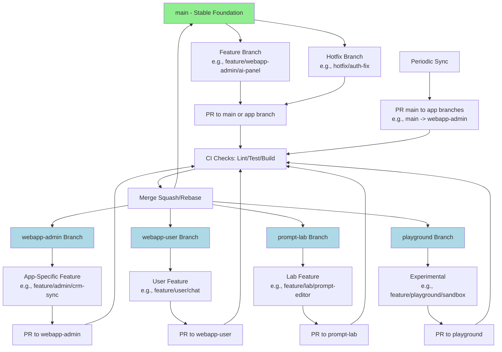

# Git Branching Strategy

This document outlines the Git branching model for the How AI Connects monorepo, designed to support a clean four-branch split while preserving a single, rock-solid `main` branch. The strategy follows Git Flow principles adapted for Turborepo monorepos: `main` as production-ready foundation, app-specific long-lived branches (webapp-admin, webapp-user, prompt-lab, playground), short-lived feature/hotfix branches, and PR-based merges with CI gates. This ensures isolation between apps while allowing shared changes to propagate via `main`.

## Core Principles

- **main**: Always stable, production-ready code. Only merge vetted changes from app branches or hotfixes. Used for all downstream merges (e.g., feature branches start from `main`).
- **App Branches**: Long-lived branches for each deployable app (e.g., `webapp-admin`). Features specific to an app merge here; periodic merges from `main` for shared updates.
- **Feature Branches**: Short-lived, branched from `main` or app branch for new features. Prefix: `feature/{app}/{description}` (e.g., `feature/webapp-admin/ai-integration`).
- **Hotfix Branches**: For urgent prod fixes. Prefix: `hotfix/{description}` (e.g., `hotfix/auth-bug`), branched from `main`, merged to `main` and affected app branches.
- **Release Branches**: Optional for versioning (e.g., `release/v1.0`), but use tags on `main` for simplicity.
- **PR Rules**: All merges via PRs with required checks (lint, test, build). Target app branches for app-specific work; `main` for shared/cross-app changes.
- **Tools**: GitHub for PRs/CI; protect `main` and app branches (require reviews, status checks).

## Branching Workflow

1. **Start Feature**: `git checkout -b feature/webapp-user/chat-ui main` (or from app branch if app-specific).
2. **Develop**: Commit with conventional messages (e.g., `feat: add chat component`).
3. **PR**: Open PR to target branch (e.g., `webapp-user` for app-specific; `main` for shared).
4. **Review & Merge**: Squash or rebase merge; auto-merge if checks pass.
5. **Sync Apps**: After merging to `main`, create PR from `main` to app branches (e.g., `main` -> `webapp-admin`).
6. **Hotfix**: `git checkout -b hotfix/critical-bug main`; fix, PR to `main`; then cherry-pick to app branches.
7. **Cleanup**: Delete feature/hotfix branches post-merge.

## Mermaid Diagram: Branching Flow

- **Green**: `main` (protected, foundational).
- **Blue**: App branches (long-lived, app-specific merges).
- **Arrows**: Flow from branches to PRs to merges back to targets.
- **Sync**: Regular PRs from `main` to apps ensure shared updates (e.g., adapters changes) propagate.

## Enforcement

- **GitHub Settings**: Branch protection rules for `main` and app branches (require PRs, 2 approvals, status checks).
- **Hooks**: Husky pre-commit for conventional commits.
- **Documentation**: Update CONTRIBUTING.md with this workflow; train team via onboarding.

This strategy minimizes conflicts in the monorepo while enabling parallel app development. Review and adjust via ADR if needed.