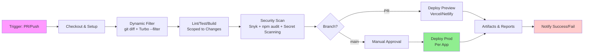

# CI/CD Pipeline Design

This document designs a simplified CI/CD pipeline for the How AI Connects monorepo using GitHub Actions, integrated with Turborepo for efficient, cached builds. The pipeline supports the four-branch split (main, webapp-admin, webapp-user, prompt-lab, playground) by dynamically scoping tasks to changed apps/packages via Turbo's `--filter` flag with git diff, ensuring no manual adjustments are needed when the structure changes. Workflows are minimal and live in `infra/github/workflows/`, with files like `ci-simple.yml`, `deploy-preview.yml`, and `deploy-prod.yml` reusing a `setup-pnpm.yml` action for consistency.

## Overview

- **Platform**: GitHub Actions (hosted runners; self-hosted for prod if needed).
- **Triggers**: PRs to any branch, pushes to `main`/app branches, tags (e.g., `v1.0`).
- **Secrets**: Stored in GitHub repo secrets (e.g., `SUPABASE_URL`, `LATITUDE_API_KEY`).
- **Caching**: Turbo remote cache; actions/cache for node_modules/pnpm.
- **Artifacts**: Publish test reports, builds to GitHub Packages.
- **Notifications**: Slack/email on failures; success for deploys.

## Workflow Structure

Core workflows:
- `ci-simple.yml`: Runs on PR/push; dynamic lint/test/build and security scan.
- `deploy-preview.yml`: Deploys to Vercel/Netlify previews on PRs.
- `deploy-prod.yml`: Deploys to prod on merge to `main`.
- `release.yml`: Creates releases/tags on `main`.

Use `setup-pnpm.yml` reusable action for consistency across all workflows.

## Stages and Dependencies

Pipeline stages in sequence, with Turbo dependencies (e.g., `build` depends on `^test`).

1. **Checkout & Setup**:
   - Action: `actions/checkout@v4`; setup Node/pnpm via `pnpm/action-setup`.
   - Cache: pnpm store.
   - Dependency: None.

2. **Dynamic Lint/Test/Build**:
   - Command: Use Turbo's `--filter` with git diff to scope to changed apps/packages, e.g., `turbo run lint --filter="$(git diff --name-only origin/main | grep -E '^apps/' | sed 's|/.*||' | sort -u | xargs -I {} turbo filter {})"`.
   - This automatically runs only on affected apps/packages (e.g., if only `webapp-admin` changed, filter to it), avoiding full matrices and manual updates.
   - Includes lint (`turbo run lint`), test (`turbo run test` for Jest + `turbo run e2e` for Playwright), and build (`turbo run build`).
   - Coverage: Upload to Codecov; threshold 80%.
   - Dependency: Setup.

3. **Security Scan**:
   - Tools: Snyk test/monitor; npm audit.
   - Add simple secret scanning: Enable GitHub's built-in secret scanning and run `npm audit --audit-level=high` to detect vulnerabilities and leaked secrets.
   - Fail on high/critical vulns or detected secrets.
   - Dependency: Dynamic Lint/Test/Build.

4. **Deploy**:
   - **Preview**: On PRs, deploy to Vercel/Netlify branches (e.g., `pr-123-webapp-admin`).
   - **Prod**: On `main` merge, deploy apps to prod environments (Vercel for webapps, Docker for prompt-lab).
   - Use dynamic filtering for deploys if needed (e.g., per changed app).
   - Dependency: Security Scan + approvals (manual for prod).

5. **Cleanup**:
   - Delete previews after PR close.
   - Dependency: Deploy.

## Dynamic Filter Example (YAML Snippet)

```yaml
- name: Dynamic Lint/Test/Build
  uses: ./.github/actions/setup-pnpm
  with:
    cache: 'pnpm'
- name: Run Turbo on Changed Packages
  run: |
    CHANGED=$(git diff --name-only ${{ github.event.before }}..${{ github.sha }} | grep -E '^apps/|^packages/' | sed 's|/.*||' | sort -u | xargs)
    if [ -n "$CHANGED" ]; then
      turbo run lint test build --filter="$CHANGED"
    else
      echo "No changes detected"
    fi
```

- **Parallelism**: Up to 4 jobs; use `needs` for dependencies.
- **Timeouts**: 10min per job; cancel in-progress on push.

## Mermaid Diagram: Pipeline Flow



- **Purple**: Trigger/setup.
- **Green**: Prod deploy.
- **Red**: Notifications.

## Dependencies and Gates

- **Turbo Graph**: Defined in `turbo.json` (e.g., `test` depends on `lint`; `build` on `^test` for packages).
- **Gates**: All stages must pass for merge (branch protection); deploy requires approvals.
- **Rollback**: On prod failure, use hotfix protocol; manual revert via Git.

## Implementation Notes

- **Location**: `infra/github/workflows/{name}.yml`.
- **Secrets Propagation**: To adapters via env (e.g., `ADAPTER_LATITUDE_API_KEY`).
- **Cost**: Free tier for open-source; monitor minutes.
- **Monitoring**: GitHub Insights for bottlenecks; optimize with dynamic filtering.

This streamlined pipeline ensures reliable, automated delivery with minimal configuration, focusing on simplicity and security. Integrate with merge policy; test via PR to `playground`.


