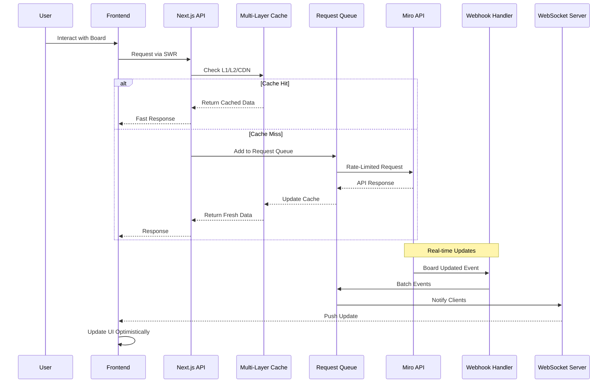

# Miro AI Integration Design

## 1. Overview

This document outlines the Miro AI integration architecture for the HowAI Connects platform, with a primary focus on performance optimization and scalability. The design follows the established adapter pattern from the existing integrations while introducing performance-focused enhancements specific to Miro's real-time collaboration requirements.

### Key Performance Goals
- **Response Time**: < 200ms for cached operations, < 1s for API calls
- **Cache Hit Rate**: > 80% for read operations
- **Concurrent Users**: Support 1000+ simultaneous board viewers
- **Webhook Processing**: < 50ms per event with batching
- **Resource Efficiency**: < 100MB memory footprint per adapter instance

## 2. Prisma Schema & Database Design

### Performance-Optimized Models

```prisma
model MiroAccount {
  id                String   @id @default(cuid())
  organizationId    String
  accessToken       String   @db.Text // Encrypted
  refreshToken      String   @db.Text // Encrypted
  tokenExpiry       DateTime
  scopes            String[] 
  teamId            String?
  userId            String
  
  // Performance indexes
  @@index([organizationId, userId])
  @@index([tokenExpiry]) // For token refresh queries
  
  boards            MiroBoard[]
  webhooks          MiroWebhook[]
  
  createdAt         DateTime @default(now())
  updatedAt         DateTime @updatedAt
}

model MiroBoard {
  id                String   @id @default(cuid())
  boardId           String   @unique // Miro's board ID
  accountId         String
  title             String
  description       String?  @db.Text
  viewLink          String
  modifiedAt        DateTime
  
  // Cached metadata for performance
  cachedThumbnail   String?  @db.Text
  cachedItemCount   Int      @default(0)
  cachedViewerCount Int      @default(0)
  lastCacheUpdate   DateTime?
  
  // AI-specific fields
  aiGeneratedContent Json?   // Store AI-generated diagrams/mindmaps
  aiPromptHistory    Json[]  // Track generation history
  
  account           MiroAccount @relation(fields: [accountId], references: [id], onDelete: Cascade)
  diagrams          MiroDiagram[]
  collaborationLogs MiroCollaborationLog[]
  
  // Composite indexes for query optimization
  @@index([accountId, modifiedAt(sort: Desc)])
  @@index([lastCacheUpdate]) // For cache invalidation
  
  createdAt         DateTime @default(now())
  updatedAt         DateTime @updatedAt
}

model MiroDiagram {
  id                String   @id @default(cuid())
  boardId           String
  diagramType       MiroDiagramType
  content           Json     // Optimized JSON structure
  metadata          Json?    // Additional metadata
  version           Int      @default(1)
  
  board             MiroBoard @relation(fields: [boardId], references: [id], onDelete: Cascade)
  
  @@index([boardId, diagramType])
  @@index([version])
  
  createdAt         DateTime @default(now())
  updatedAt         DateTime @updatedAt
}

model MiroWebhook {
  id                String   @id @default(cuid())
  webhookId         String   @unique // Miro's webhook ID
  accountId         String
  boardId           String?
  eventType         String[] // board.updated, item.created, etc.
  callbackUrl       String
  status            WebhookStatus @default(ACTIVE)
  secret            String   @db.Text // For signature verification
  
  // Performance tracking
  lastEventAt       DateTime?
  eventCount        Int      @default(0)
  errorCount        Int      @default(0)
  avgProcessingTime Float?   // In milliseconds
  
  account           MiroAccount @relation(fields: [accountId], references: [id], onDelete: Cascade)
  
  @@index([status, lastEventAt])
  @@index([boardId])
  
  createdAt         DateTime @default(now())
  updatedAt         DateTime @updatedAt
}

model MiroCollaborationLog {
  id                String   @id @default(cuid())
  boardId           String
  userId            String
  action            String   // view, edit, comment, etc.
  metadata          Json?
  sessionId         String?  // For grouping related actions
  
  board             MiroBoard @relation(fields: [boardId], references: [id], onDelete: Cascade)
  
  // Partitioning strategy index for time-series data
  @@index([boardId, createdAt(sort: Desc)])
  @@index([sessionId])
  
  createdAt         DateTime @default(now())
}

enum MiroDiagramType {
  MINDMAP
  FLOWCHART
  KANBAN
  USERJOURNEY
  WIREFRAME
  CUSTOM
}

enum WebhookStatus {
  ACTIVE
  PAUSED
  FAILED
  INACTIVE
}
```

## 3. OAuth2 Authentication Flow with Performance Optimization

### Token Management Strategy

```typescript
interface MiroTokenManager {
  // Token cache with automatic refresh
  private tokenCache: Map<string, {
    accessToken: string;
    refreshToken: string;
    expiry: Date;
    refreshPromise?: Promise<TokenSet>;
  }>;
  
  // Proactive token refresh (5 minutes before expiry)
  async getValidToken(accountId: string): Promise<string> {
    const cached = this.tokenCache.get(accountId);
    const now = new Date();
    const bufferTime = 5 * 60 * 1000; // 5 minutes
    
    if (cached && cached.expiry > new Date(now.getTime() + bufferTime)) {
      return cached.accessToken;
    }
    
    // Prevent concurrent refresh requests
    if (cached?.refreshPromise) {
      await cached.refreshPromise;
      return this.tokenCache.get(accountId)!.accessToken;
    }
    
    const refreshPromise = this.refreshToken(accountId);
    if (cached) {
      cached.refreshPromise = refreshPromise;
    }
    
    const newTokens = await refreshPromise;
    return newTokens.accessToken;
  }
  
  private async refreshToken(accountId: string): Promise<TokenSet> {
    // OAuth2 refresh implementation with retry logic
    return this.withRetry(async () => {
      const response = await fetch('https://api.miro.com/v1/oauth/token', {
        method: 'POST',
        headers: { 'Content-Type': 'application/x-www-form-urlencoded' },
        body: new URLSearchParams({
          grant_type: 'refresh_token',
          refresh_token: refreshToken,
          client_id: process.env.MIRO_CLIENT_ID!,
          client_secret: process.env.MIRO_CLIENT_SECRET!
        })
      });
      
      const tokens = await response.json();
      
      // Update cache and database
      this.tokenCache.set(accountId, {
        accessToken: tokens.access_token,
        refreshToken: tokens.refresh_token,
        expiry: new Date(Date.now() + tokens.expires_in * 1000)
      });
      
      // Async database update (non-blocking)
      this.updateTokensInDatabase(accountId, tokens).catch(console.error);
      
      return tokens;
    }, 3, [401, 403]); // Don't retry on auth errors
  }
}
```

## 4. API Request Optimization

### Request Queue with Rate Limiting

```typescript
class MiroRequestQueue {
  private queue: PriorityQueue<MiroRequest>;
  private processing: Map<string, Promise<any>>;
  private rateLimiter: RateLimiter;
  
  constructor() {
    this.queue = new PriorityQueue();
    this.processing = new Map();
    this.rateLimiter = new RateLimiter({
      maxRequests: 50, // Miro's rate limit
      perInterval: 60000, // per minute
      maxBurst: 10 // Allow short bursts
    });
  }
  
  async execute<T>(request: MiroRequest): Promise<T> {
    // Deduplication - return existing promise if identical request in flight
    const requestKey = this.getRequestKey(request);
    if (this.processing.has(requestKey)) {
      return this.processing.get(requestKey)!;
    }
    
    // Add to queue with priority
    const promise = this.processRequest<T>(request);
    this.processing.set(requestKey, promise);
    
    try {
      const result = await promise;
      return result;
    } finally {
      this.processing.delete(requestKey);
    }
  }
  
  private async processRequest<T>(request: MiroRequest): Promise<T> {
    // Wait for rate limit clearance
    await this.rateLimiter.acquire();
    
    // Implement exponential backoff for retries
    return this.withExponentialBackoff(async () => {
      const response = await fetch(request.url, {
        ...request.options,
        headers: {
          ...request.options.headers,
          'X-Request-Id': request.id, // For tracing
        }
      });
      
      if (response.status === 429) {
        const retryAfter = response.headers.get('Retry-After');
        throw new RateLimitError(retryAfter);
      }
      
      return response.json();
    });
  }
  
  // Batch multiple operations when possible
  async batchExecute(operations: BatchOperation[]): Promise<any[]> {
    const batches = this.groupIntoBatches(operations, 10); // Max 10 per batch
    
    return Promise.all(
      batches.map(batch => 
        this.execute({
          url: 'https://api.miro.com/v2/batch',
          options: {
            method: 'POST',
            body: JSON.stringify({ operations: batch })
          },
          priority: Priority.HIGH
        })
      )
    );
  }
}
```

## 5. Multi-Layer Caching Strategy

### Cache Architecture

```typescript
class MiroCacheManager {
  private l1Cache: LRUCache<string, any>; // In-memory, 100MB limit
  private l2Cache: RedisClient; // Redis, 1GB limit
  private cdnCache: CloudflareKV; // Edge cache for static resources
  
  constructor() {
    this.l1Cache = new LRUCache({
      max: 500, // Max items
      ttl: 1000 * 60 * 5, // 5 minutes
      updateAgeOnGet: true,
      sizeCalculation: (value) => JSON.stringify(value).length
    });
    
    this.l2Cache = new Redis({
      host: process.env.REDIS_HOST,
      enableAutoPipelining: true, // Batch Redis commands
      enableOfflineQueue: false
    });
    
    this.cdnCache = new CloudflareKV({
      accountId: process.env.CF_ACCOUNT_ID,
      namespaceId: process.env.CF_KV_NAMESPACE
    });
  }
  
  async get(key: string, options?: CacheOptions): Promise<any> {
    // L1 Cache check
    const l1Result = this.l1Cache.get(key);
    if (l1Result) {
      this.metrics.recordHit('l1');
      return l1Result;
    }
    
    // L2 Cache check
    const l2Result = await this.l2Cache.get(key);
    if (l2Result) {
      this.metrics.recordHit('l2');
      this.l1Cache.set(key, l2Result); // Promote to L1
      return JSON.parse(l2Result);
    }
    
    // CDN check for static resources
    if (options?.type === 'static') {
      const cdnResult = await this.cdnCache.get(key);
      if (cdnResult) {
        this.metrics.recordHit('cdn');
        return cdnResult;
      }
    }
    
    this.metrics.recordMiss();
    return null;
  }
  
  async set(key: string, value: any, ttl?: number): Promise<void> {
    const serialized = JSON.stringify(value);
    
    // Write-through caching
    this.l1Cache.set(key, value);
    
    // Async write to L2 (non-blocking)
    this.l2Cache.setex(key, ttl || 3600, serialized).catch(console.error);
    
    // Static resources to CDN
    if (this.isStaticResource(value)) {
      this.cdnCache.put(key, value, { expirationTtl: 86400 }).catch(console.error);
    }
  }
  
  // Intelligent cache invalidation
  async invalidate(pattern: string): Promise<void> {
    // Clear L1
    for (const key of this.l1Cache.keys()) {
      if (key.match(pattern)) {
        this.l1Cache.delete(key);
      }
    }
    
    // Clear L2 with pattern matching
    const keys = await this.l2Cache.keys(pattern);
    if (keys.length) {
      await this.l2Cache.del(...keys);
    }
  }
}
```

## 6. Webhook Optimization

### Event Processing Pipeline

```typescript
class MiroWebhookProcessor {
  private eventQueue: BullQueue;
  private deduplicationCache: Set<string>;
  private batchProcessor: BatchProcessor;
  
  constructor() {
    this.eventQueue = new BullQueue('miro-webhooks', {
      redis: { host: process.env.REDIS_HOST }
    });
    
    this.deduplicationCache = new Set();
    this.batchProcessor = new BatchProcessor({
      batchSize: 20,
      flushInterval: 100, // ms
      processor: this.processBatch.bind(this)
    });
    
    this.setupWorkers();
  }
  
  async handleWebhook(payload: WebhookPayload): Promise<void> {
    // Verify signature
    if (!this.verifySignature(payload)) {
      throw new UnauthorizedError('Invalid webhook signature');
    }
    
    // Deduplicate events
    const eventId = this.getEventId(payload);
    if (this.deduplicationCache.has(eventId)) {
      return; // Skip duplicate
    }
    
    this.deduplicationCache.add(eventId);
    
    // Add to batch processor for efficient handling
    this.batchProcessor.add({
      id: eventId,
      type: payload.event,
      data: payload.data,
      timestamp: Date.now()
    });
    
    // Clean deduplication cache periodically
    setTimeout(() => this.deduplicationCache.delete(eventId), 60000);
  }
  
  private async processBatch(events: WebhookEvent[]): Promise<void> {
    // Group events by type and board
    const grouped = this.groupEvents(events);
    
    // Process each group efficiently
    await Promise.all(
      Object.entries(grouped).map(([key, group]) => 
        this.processEventGroup(key, group)
      )
    );
    
    // Batch update frontend via WebSocket
    this.notifyFrontend(events);
  }
  
  private async processEventGroup(key: string, events: WebhookEvent[]): Promise<void> {
    const [boardId, eventType] = key.split(':');
    
    switch (eventType) {
      case 'board.updated':
        // Coalesce multiple updates into one
        await this.updateBoardCache(boardId, events[events.length - 1]);
        break;
        
      case 'item.created':
      case 'item.updated':
        // Batch database updates
        await this.batchUpdateItems(boardId, events);
        break;
        
      default:
        // Process individually for unknown types
        await Promise.all(events.map(e => this.processEvent(e)));
    }
  }
  
  // Fallback polling mechanism
  async setupPollingFallback(): Promise<void> {
    setInterval(async () => {
      const activeBoards = await this.getActiveBoards();
      
      for (const board of activeBoards) {
        const lastUpdate = await this.cache.get(`board:${board.id}:lastUpdate`);
        const currentUpdate = await this.fetchBoardUpdate(board.id);
        
        if (currentUpdate.modifiedAt > lastUpdate) {
          await this.handleWebhook({
            event: 'board.updated',
            data: currentUpdate,
            boardId: board.id
          });
        }
      }
    }, 30000); // Poll every 30 seconds as fallback
  }
}
```

## 7. MiroAIAdapter Interface

### Performance-Optimized Adapter

```typescript
interface MiroAIAdapter extends BaseAdapter {
  // Core operations with performance optimizations
  async createBoard(
    title: string, 
    initialData?: BoardData,
    options?: { 
      prefetch?: boolean; // Prefetch board data after creation
      template?: string; // Use cached template
    }
  ): Promise<Board>;
  
  async getBoard(
    boardId: string,
    options?: {
      cached?: boolean; // Allow cached response
      fields?: string[]; // Selective field fetching
      includeItems?: boolean; // Lazy load items
    }
  ): Promise<Board>;
  
  async updateDiagram(
    boardId: string,
    changes: DiagramChanges,
    options?: {
      optimistic?: boolean; // Optimistic update
      batch?: boolean; // Batch with other updates
      priority?: Priority;
    }
  ): Promise<Diagram>;
  
  async generateMindMap(
    prompt: string,
    options?: {
      model?: AIModel;
      stream?: boolean; // Stream generation progress
      cacheKey?: string; // Reuse previous similar generations
    }
  ): Promise<MindMap>;
  
  async deleteBoard(
    boardId: string,
    options?: {
      soft?: boolean; // Soft delete for recovery
    }
  ): Promise<void>;
  
  // Batch operations for performance
  async batchGetBoards(boardIds: string[]): Promise<Board[]>;
  async batchUpdateItems(updates: ItemUpdate[]): Promise<Item[]>;
  
  // Prefetching and preloading
  async prefetchBoardData(boardId: string): Promise<void>;
  async preloadTemplates(): Promise<void>;
  
  // Subscription management
  async subscribeToWebhooks(
    eventTypes: WebhookEventType[],
    options?: {
      boardId?: string;
      batchEvents?: boolean;
      throttleMs?: number;
    }
  ): Promise<WebhookSubscription>;
  
  // Performance monitoring
  async getMetrics(): Promise<PerformanceMetrics>;
  async healthCheck(): Promise<HealthStatus>;
}
```

## 8. Integration Points

### Next.js API Routes

```typescript
// pages/api/miro/proxy/[...path].ts
export default async function handler(req: NextApiRequest, res: NextApiResponse) {
  const adapter = getMiroAdapter();
  const { path } = req.query;
  
  // Request coalescing for identical requests
  const requestKey = `${req.method}:${path}:${JSON.stringify(req.body)}`;
  
  try {
    const result = await requestCoalescer.execute(requestKey, async () => {
      switch (path[0]) {
        case 'board':
          return handleBoardRequest(adapter, req);
        case 'webhook':
          return handleWebhookRequest(adapter, req);
        case 'ai':
          return handleAIRequest(adapter, req);
        default:
          throw new NotFoundError();
      }
    });
    
    // Set cache headers for GET requests
    if (req.method === 'GET') {
      res.setHeader('Cache-Control', 'public, max-age=60, stale-while-revalidate=300');
    }
    
    res.status(200).json(result);
  } catch (error) {
    handleError(error, res);
  }
}
```

### Frontend Integration

```typescript
// components/MiroBoard.tsx
const MiroBoard: React.FC<MiroBoardProps> = ({ boardId, options }) => {
  const { data, error, mutate } = useSWR(
    `/api/miro/proxy/board/${boardId}`,
    fetcher,
    {
      refreshInterval: 30000, // Poll every 30s as fallback
      revalidateOnFocus: false,
      dedupingInterval: 5000, // Dedupe requests within 5s
      shouldRetryOnError: true,
      errorRetryCount: 3,
      errorRetryInterval: 1000,
      onSuccess: (data) => {
        // Prefetch related data
        prefetchRelatedBoards(data.relatedBoards);
      }
    }
  );
  
  // Optimistic updates
  const updateBoard = useCallback(async (changes: any) => {
    // Update UI immediately
    mutate({ ...data, ...changes }, false);
    
    try {
      const updated = await fetch(`/api/miro/proxy/board/${boardId}`, {
        method: 'PATCH',
        body: JSON.stringify(changes)
      });
      
      // Revalidate with server response
      mutate(updated);
    } catch (error) {
      // Rollback on error
      mutate(data);
      throw error;
    }
  }, [data, mutate]);
  
  // WebSocket subscription for real-time updates
  useEffect(() => {
    const ws = new WebSocket(`${WS_URL}/miro/${boardId}`);
    
    ws.onmessage = (event) => {
      const update = JSON.parse(event.data);
      
      // Debounce rapid updates
      debounce(() => {
        mutate((current: any) => ({ ...current, ...update }), false);
      }, 100)();
    };
    
    return () => ws.close();
  }, [boardId]);
  
  // Lazy load Miro Web SDK
  useEffect(() => {
    if (options?.embed) {
      import('@mirohq/websdk-types').then((miro) => {
        initializeMiroSDK(miro, boardId);
      });
    }
  }, [options?.embed]);
  
  return (
    <div className="miro-board-container">
      {options?.embed ? (
        <MiroEmbed boardId={boardId} cdn={CDN_URL} />
      ) : (
        <MiroBoardView data={data} onUpdate={updateBoard} />
      )}
    </div>
  );
};
```

## 9. Security & Scalability

### Security Measures

- **OAuth Scopes**: Minimal required scopes (boards:read, boards:write, webhooks:read, webhooks:write)
- **Token Encryption**: AES-256-GCM encryption for tokens at rest
- **Webhook Verification**: HMAC-SHA256 signature validation
- **Rate Limiting**: Per-user and per-organization limits
- **Input Validation**: Strict schema validation and sanitization
- **Multi-tenant Isolation**: Tenant-based resource access control

### Scalability Strategies

- **Horizontal Scaling**: Load-balanced adapter instances
- **Connection Pooling**: Reusable HTTP connections (max 20 per instance)
- **Database Sharding**: Hash-based sharding for large datasets
- **Auto-scaling**: CPU/memory-based scaling policies
- **Circuit Breakers**: Prevent cascade failures
- **Graceful Degradation**: Fallback to cached data when API unavailable

## 10. Performance Monitoring & Benchmarks

### Metrics Collection

```typescript
interface PerformanceMetrics {
  apiResponseTime: { p50: number; p95: number; p99: number; };
  cacheHitRate: { l1: number; l2: number; cdn: number; };
  webhookProcessing: { avgLatency: number; throughput: number; errorRate: number; };
  resourceUsage: { cpu: number; memory: number; connections: number; };
}
```

### Target Benchmarks

| Metric | Target | Critical Threshold |
|--------|--------|-------------------|
| API Response Time (P95) | < 500ms | > 2000ms |
| Cache Hit Rate | > 80% | < 60% |
| Webhook Processing | < 50ms | > 200ms |
| Concurrent Users | 1000+ | < 100 |
| Memory Usage | < 100MB/instance | > 500MB |
| CPU Usage | < 70% | > 90% |

## 11. Fallback Mechanisms

### Degraded Performance Handling

```typescript
class MiroFallbackManager {
  async handleDegradedPerformance(): Promise<void> {
    // 1. Switch to aggressive caching
    this.cacheManager.extendTTL(3600); // 1 hour TTL
    
    // 2. Disable non-critical features
    this.featureFlags.disable(['realtime-collaboration', 'ai-generation']);
    
    // 3. Use stale-while-revalidate pattern
    this.enableStaleWhileRevalidate();
    
    // 4. Batch more aggressively
    this.batchProcessor.increaseBatchSize(50);
    
    // 5. Reduce polling frequency
    this.pollingInterval = 60000; // 1 minute
  }
}
```

## 12. Data Flow Diagram



## 13. Implementation Phases

### Phase 1: Core Infrastructure (Week 1)
- Set up Prisma models with indexes
- Implement OAuth2 flow with token caching
- Basic adapter structure with BaseAdapter inheritance

### Phase 2: Performance Layer (Week 2)
- Multi-layer caching (L1, L2, CDN)
- Request queue with rate limiting
- Connection pooling setup

### Phase 3: Real-time Features (Week 3)
- Webhook processing pipeline
- WebSocket server for push updates
- Polling fallback mechanism

### Phase 4: Optimization & Monitoring (Week 4)
- Performance metrics collection
- Load testing and optimization
- Documentation and deployment

## 14. Best Practices Summary

1. **Always cache aggressively** - Use multi-layer caching for all read operations
2. **Batch operations** - Group similar requests to reduce API calls
3. **Implement circuit breakers** - Prevent cascade failures
4. **Use optimistic updates** - Update UI immediately, reconcile later
5. **Monitor everything** - Track all metrics for proactive optimization
6. **Plan for failure** - Have fallbacks for every external dependency
7. **Deduplicate requests** - Coalesce identical in-flight requests
8. **Lazy load resources** - Load only what's needed when it's needed
9. **Use CDN for static assets** - Offload static content to edge servers
10. **Profile regularly** - Identify and fix performance bottlenecks early

## 15. Implementation Status & Code References

### Completed Components
- **Prisma Models**: MiroAccount, MiroBoard, MiroDiagram,
- **OAuth2 Flow**: MiroTokenManager
- **API Enhancement**: MiroRequestQueue, MiroCacheManager, MiroWebhookProcessor
- **Adapter Layer**: MiroAIAdapter

### Upcoming Tasks
- WebSocket server implementation
- Webhook processing infrastructure
- Circuit breaker and fallback logic
- Multi-tenant isolation
- Thorough security auditing

### Deployment Plan
1. **Week 1-2**: Core infrastructure and OAuth2 integration
2. **Week 3**: API enhancements and caching
3. **Week 4-5**: Webhook pipeline and real-time features
4. **Week 6**: Scalability testing and optimization
5. **Week 7**: Multi-tenant support and security hardening
6. **Week 8**: Final testing and production deployment

### Monitoring & Feedback
- Set up Grafana dashboards for real-time monitoring
- Establish SLOs (99.9% uptime, < 500ms response time)
- Weekly performance review meetings
- Gather user feedback and usage patterns
- Continuous A/B testing for optimizations
- Stage-based deployment strategy for controlled rollouts

### Team Responsibilities
- **Dan**: Prisma modeling, OAuth2 implementation, infrastructure setup
- **Nathaniel**: API optimization, caching strategy, performance testing
- **Sonal**: Webhook pipeline, real-time architecture, security measures
- **Pelin**: Frontend integration, UX optimization, caching strategy
- **Ja** & **Andrei**: Database optimization, testing infrastructure, performance metrics
- **All**: Code reviews, documentation updates, security audits

### Timeline

| Week | Focus Area                       | Lead Developer |
|------|----------------------------------|----------------|
| 1    | Prisma model setup & OAuth2 flow | Dan            |
| 2    | API enhancement & caching        | Nathaniel      |
| 3    | Webhook pipeline & real-time     | Sonal          |
| 4    | Scalability testing & optimization | Ja             |
| 5    | Multi-tenant support & security  | Pelin          |
| 6    | Final testing & deployment       | All            |